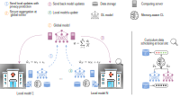
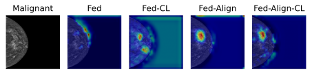

## Memory-aware curriculum federated learning for breast cancer classification
#### by Amelia Jiménez-Sánchez, Mickael Tardy, Miguel A. González Ballester, Diana Mateus, Gemma Piella

This repository provides a PyTorch implementation of our work -> [[**arXiv**]](https://arxiv.org/abs/2107.02504)

## Overview 
In this work, we integrate for the first time curriculum learning to improve breast cancer classification in a federated setting. We deploy a collaborative global model trained on three clinical datasets from different vendors (two private and one publicly available). In this federated setting, no imaging data is shared across institutions. For a precise diagnosis, we train our collaborative model on high-resolution mammograms. We focus on scheduling the training samples paying special attention to those that are forgotten during the intermediate updates of the global model. Our approach is combined with unsupervised domain adaptation to deal with domain shift while preserving data privacy. Our results verify the effectiveness of federated adversarial learning for the multi-site breast cancer classification. Moreover, we show that our proposed memory-aware curriculum method is beneficial to further improve classification performance. 

<p align="center"></p> 

## Usage
### 1. Cloning the repository
```bash
$ git clone https://github.com/ameliajimenez/curriculum-federated-learning.git
$ cd curriculum-federated-learning/
```
To use the pretrained weights from [Wu *et al.*](https://ieeexplore.ieee.org/document/8861376), download `sample_image_model.p` from [nyukat/breast_cancer_classifier](https://github.com/nyukat/breast_cancer_classifier) and place it under `models/pretrained` folder.

### 2. Single and Mix
It is possible to train a Mix model with more than one datasets using `single.py`. To do that, modify `PATH` and specify the directory for the datasets in `train_dir`.
 ```bash
$ python single.py
```

### 3. Federated Learning (Fed)
 ```bash
$ python federated.py
```

### 4. Curriculum Federated Learning (Fed-CL)
 ```bash
$ python federated_curriculum.py
```

### 5. Federated Adversarial Learning (Fed-Align)
 ```bash
$ python federated_align.py
```

### 6. Curriculum Federated Adversarial Learning (Fed-Align-CL)
```bash
$ python federated_align_curriculum.py
```

### 7. Evaluating the model
```bash
$ python test.py
```

### 8. Grad-CAM visualization
Compare the Gradient Class Activation Map (Grad-CAM) for the different federated models.
```bash
$ python test_misclassified_gradcam.py
```

<p align="center"></p> 

## Citation
If this work is useful for your research, please cite our [paper](https://arxiv.org/abs/2107.02504):
```
@misc{jimenez2021memoryaware,
      title={Memory-aware curriculum federated learning for breast cancer classification}, 
      author={Amelia Jiménez-Sánchez and Mickael Tardy and Miguel A. González Ballester and Diana Mateus and Gemma Piella},
      year={2021},
      eprint={2107.02504},
      archivePrefix={arXiv},
      primaryClass={cs.CV}
}
```

### Acknowledgments
Repositories that were used in this work: [xxlya/Fed_ABIDE](https://github.com/xxlya/Fed_ABIDE), [nyukat/breast_cancer_classifier](https://github.com/nyukat/breast_cancer_classifier) and [jacobgil/pytorch-grad-cam](https://github.com/jacobgil/pytorch-grad-cam).
